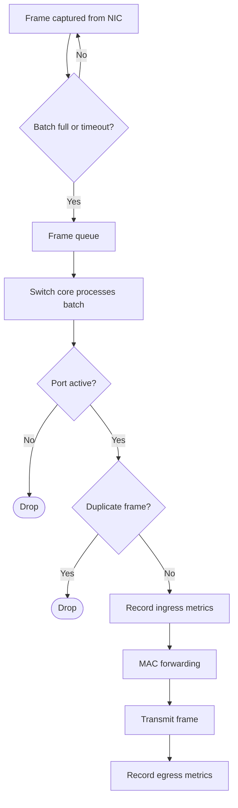
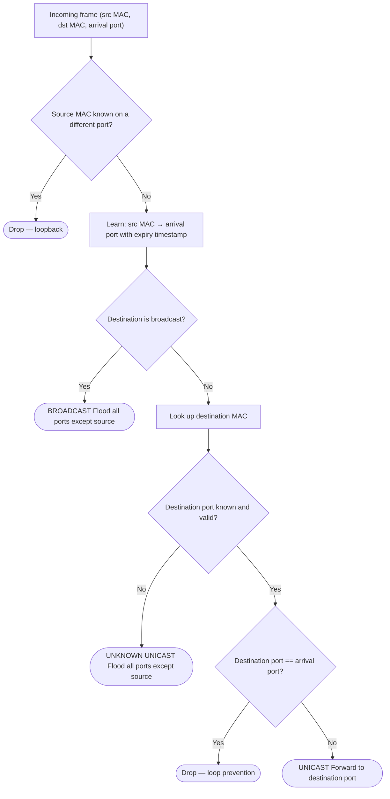
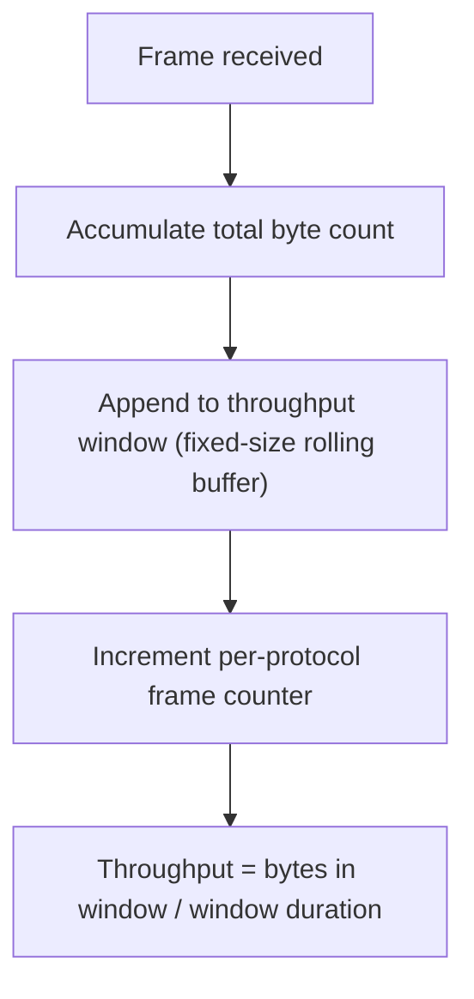

# PSIP  - Multilayer Software Switch

<name, email, id> (placeholders for my real IDs)
A semestral project in the course of Switching and Routing in IP networks, SS 2025/2026

## Assignment Text (copy paste)

Design and implement a multilayer software switch based on the knowledge obtained in the course on Computer and Communication Networks. As a final implementation, a solution with a two-port switch (two network cards, port 1 and port 2) is sufficient, while controlling the network interfaces with the appropriate packet controllers.

Design and implement the switch in C++ or C# (other languages need to be consulted with instructor). Design a switch to meet the requirements of tasks 1-5.

Application logic must be designed and implemented by student – using AI generated code is not permitted.

The solution, including individual checkpoints, will be examined using real Cisco networking infrastructure.

### Minimal Requirements (copy paste)

To participate in the final exam, the assignment must have at least the functionality of the switch correctly implemented (a hub is not sufficient), i.e., tasks 1 and 2. Without fulfilling this condition, the student will not be admitted to the final exam.

## Project implementation

The project is implemented in Python, chosen after consulting with the lab instructor due to the GUI requirement — Python's ecosystem made meeting that requirement significantly more practical than C++ or C#. The GUI is built with PySide6 and the qfluentwidgets component library; AI assistance was used for the GUI boilerplate, as disclosed to the instructor. The core switching logic, protocol parsing, and all network-related components are implemented independently.

### Dependencies

- PySide6 — Qt Python bindings, used for the GUI
- PySide6-Fluent-Widgets (qfluentwidgets) — Fluent Design component library for consistent styling
- scapy — network interface enumeration and Windows NIC metadata retrieval
- wpcap.dll — native Windows DLL (part of Npcap), used directly via ctypes for low-level frame capture and transmission
- wmi — Windows Management Instrumentation bindings, used to detect physical link connect/disconnect events
- pydantic — configuration schema validation and serialization
- tomli_w — writing TOML configuration files
- dotenv — reading .env files for environment-level configuration
- watchdog — file system watching for live configuration reload
- psutil — querying Windows network interface state

## Core switch logic

### Frame processing flowchart

#### Top-level pipeline

#### MAC learning and forwarding

#### Metrics recording (per direction)

### Cable pullout

Physical link state changes — cable insertion and removal — are detected through Windows Management Instrumentation (WMI). A dedicated background thread subscribes to modification events on the `Win32_NetworkAdapter` WMI class, polling with a one-second timeout to remain responsive to the application shutdown signal.

When a WMI event fires, the reported adapter is matched against the currently assigned physical interfaces by comparing the adapter's GUID field against the GUID stored for each slot. If no assigned slot claims the GUID, the event is silently discarded. Otherwise, the current `NetEnabled` field on the event object is compared against the previously known link state for that slot. A `True -> False` transition is treated as a cable disconnection; any transition into `True` is treated as a connection.

On disconnect, the MAC table entries associated with the affected slot are immediately invalidated to prevent stale forwarding entries from routing traffic to an interface that is no longer reachable. Both events are reported via the logging system, which forwards them to syslog if configured.

## Task 1: Media Access Control Table

The MAC table maps MAC addresses to interface slots, learning exclusively from incoming L2 traffic. A background thread periodically expires entries whose TTL has elapsed; the table is also cleared immediately when an interface is unassigned, or physical link loss is detected on a slot.

When a captured frame is processed, the destination MAC is looked up in the table. If no entry exists, the frame is flooded to all connected slots except the one it arrived on. If an entry is found, the frame is forwarded only to the mapped slot.

Code 1: MAC table implementation taken directly from the project’s source code. [image from source files]

## Task 2: Statistics

Per-interface statistics are tracked separately for ingress and egress traffic. To count frames by protocol, each captured frame is parsed through the full protocol stack; every protocol identified in the frame increments its respective counter. This naturally covers OSI layers 2 through 7 for any frame that contains them. A cumulative byte counter is maintained alongside a fixed-size rolling buffer of recent frame entries, which allows throughput to be computed over an arbitrary time window by summing the bytes within it. Resetting the counters is trivial — the dictionaries and rolling buffer are simply replaced with fresh empty ones.

Note on ingress correctness: the ingress metrics may be skewed due to wpcap.dll mirroring traffic across multiple interfaces on Windows. Deduplication does not resolve the underlying data race, so ingress counts may be incorrectly attributed to the wrong slot in some cases. No satisfactory solution to this was found within the scope of the project.

Code 2: Example implementation taken directly from project source files. [image from source files]

## Task 4: Syslog

Syslog functionality is verified using tftpd64 as the syslog server, with messages formatted according to RFC 5424. After consulting with the lab instructor, the host OS network stack can be used for UDP transport, so no raw packet crafting is required for this service nor the underlying ARP resolution as it will be handled by the OS.

The Python standard library's socket module provides a thin wrapper over the OS socket API, sufficient to send raw UDP datagrams. A datagram socket is created, optionally bound to a configurable source IP address, and messages are serialized to the RFC 5424 wire format: `<PRI>1 TIMESTAMP HOSTNAME APP-NAME PROCID MSGID STRUCTURED-DATA MSG`, where the priority field encodes both facility (LOG_USER = 1) and severity, and the timestamp follows RFC 3339 in UTC (e.g. `2026-03-12T14:03:05Z`).

Rather than maintaining a separate logging path, the implementation hooks into Python's standard logging module via a custom handler. This gives access to all log records produced anywhere in the application, along with their severity. The supported severity levels are INFO, WARNING, ERROR, and CRITICAL, remapped to their RFC 5424 equivalents. DEBUG is intentionally excluded from syslog forwarding — a failed syslog send logs a debug message internally, and forwarding that over syslog would cause an infinite feedback loop. A configurable minimum severity threshold allows filtering at runtime.

The following activities are recorded via syslog:

1. Switch core initialized/shutdown — emitted at CRITICAL on successful initialisation or shutdown of the switch core logic.
2. Physical link up on slot N — emitted at INFO when a cable is detected on a slot via WMI network adapter monitoring.
3. Physical link down on slot N — emitted at INFO when a cable is removed from a slot.
4. Interface slot assigned — emitted at INFO when a physical interface is bound to a switch slot.
5. Interface slot unassigned — emitted at INFO when a physical interface is removed from a switch slot.

Syslog can be enabled or disabled and reconfigured (server IP, source IP, port, severity threshold) at runtime through the Services panel in the GUI. Settings are validated and only committed after a test packet is successfully sent to the configured server, though not if it was actually received.

Code 3: Project syslog implementation snippet [image from source files]

### Packet structure

A syslog message is carried over standard UDP/IP. The host OS resolves ARP and constructs the lower-layer headers, so the application only controls the UDP payload. The encapsulation is: Ethernet II → IPv4 → UDP → RFC 5424 syslog message.

[image: Ethernet II frame structure — Wikipedia]

[image: IPv4 header structure — Wikipedia]

[image: UDP datagram structure — Wikipedia]

The destination UDP port is 514 by default (configurable). Source port is assigned by the OS. The source and destination IP addresses are configurable through the Services panel; if no source IP is set the OS picks the appropriate interface address.

#### RFC 5424 message format

The syslog payload is a UTF-8 string with the following structure:

`<PRI>VERSION TIMESTAMP HOSTNAME APP-NAME PROCID MSGID STRUCTURED-DATA MSG`

- **PRI** — priority value encoded as `<facility × 8 + severity>`. PySwitch uses facility `1` (LOG_USER). Severity values: INFO = 6, WARNING = 4, ERROR = 3, CRITICAL = 2.
- **VERSION** — always `1` per RFC 5424.
- **TIMESTAMP** — RFC 3339 UTC timestamp with second precision, e.g. `2026-03-12T14:03:05Z`.
- **HOSTNAME** — the machine's hostname as returned by the OS.
- **APP-NAME** — `PySwitch`.
- **PROCID**, **MSGID**, **STRUCTURED-DATA** — all set to the nil value `-` as these fields are not used.
- **MSG** — the logger name and message text, e.g. `PySwitch.network.core: Initialized`.
